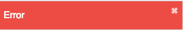

# Toaster

## Concept
The module toaster allows you to show notification messages

### Toaster methods
| Method | Example |
|--|--|
| toaster.pop(type, message) |  |
| toaster.succes(message) |  |
| toaster.error(message) |  |
| toaster.warn(message) |  |
| toaster.info(message) |  |

### Usage

```js
  import FpToaster from 'forepaas/toaster'

  FpToaster.success('Success')
  FpToaster.error('Error')
  FpToaster.warn('Warning')
  FpToastwr.info('Info')
```

## Add another notification system

You can specify your own notification library
To do that you juste have to add your library to our sdk modules
```js
  import FpSdk from 'forepaas/sdk'
  import FooToaster from './FooToaster'

  FpSdk.modules['foo-toaster'] = FooToaster
```
And then add it to config/global.json
```js
{
  "toaster": "foo-toaster"
}
```

Your own library only need to have a pop methods that takes two parameters:
  - type
  - message